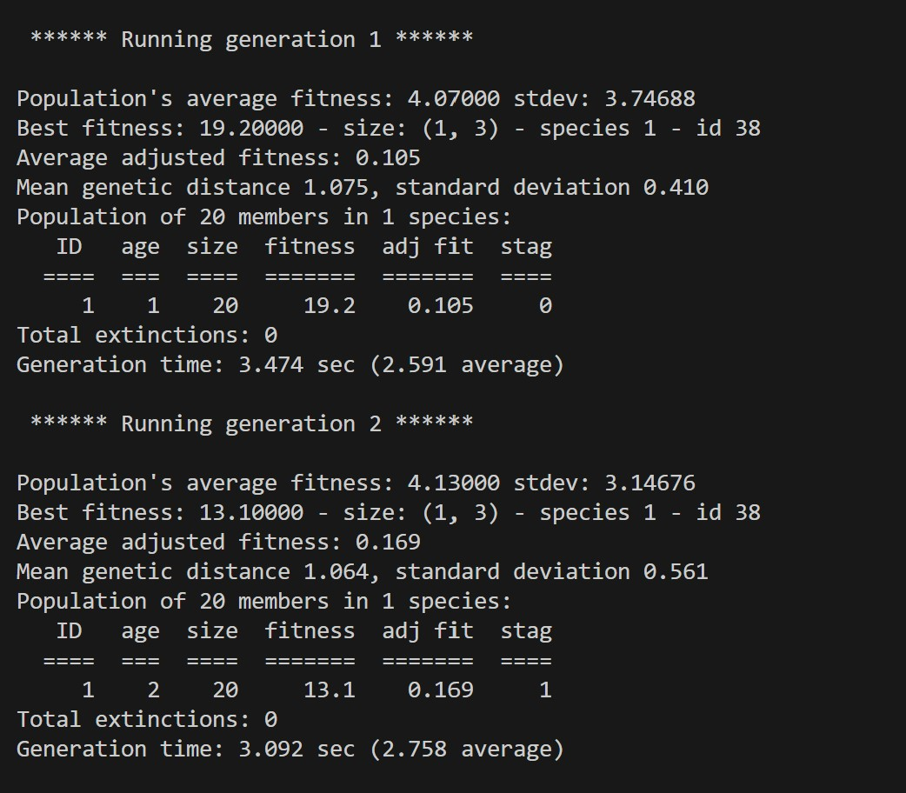

# Flappy Bird AI Using NEAT

This project implements an AI agent to play Flappy Bird using the **NEAT (NeuroEvolution of Augmenting Topologies)** algorithm. The bird learns to play by evolving its neural network over generations.
## Inspiration

This project is inspired by the implementation of NEAT by **Tech With Tim**. Check out the tutorial series on [YouTube](https://www.youtube.com/watch?v=MMxFDaIOHsE&list=PLzMcBGfZo4-lwGZWXz5Qgta_YNX3_vLS2).

---

## Features
- **Flappy Bird Gameplay**: A basic implementation of the Flappy Bird game using `pygame`.
- **NEAT Integration**: The AI agent learns to play by evolving its neural network using the NEAT library.
- **Dynamic Obstacles**: Pipes appear at random heights and move across the screen.
- **Fitness Evaluation**: The bird is rewarded for staying alive longer and successfully passing pipes.

---

## Prerequisites
- Python 3.x
- Required Python libraries:
  - `pygame`
  - `neat-python`

pip install pygame neat-python

## Gameplay Screenshot

Here’s a glimpse of the gameplay:

## Training Progress Screenshot

See the AI training process:

